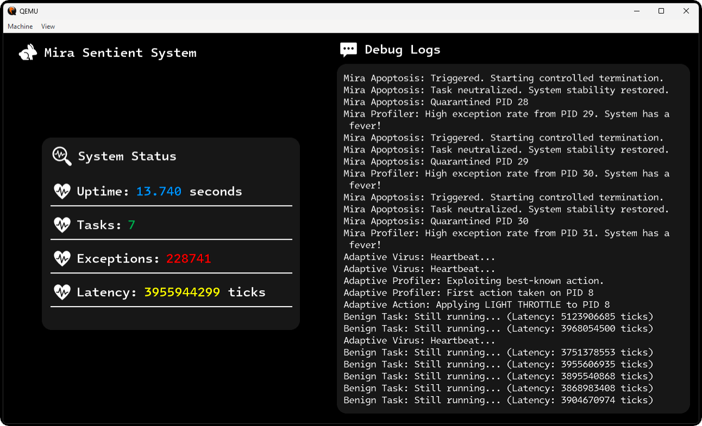

<div align="center">

</div>

<h1 align="center">Mira OS</h1>
<p align="center">
  <strong>A complete 64-bit graphical operating system, built from scratch in C and Assembly.</strong>
  <br/>
  <em>Created as a platform for my research into a novel, bio-inspired resilient kernel architecture.</em>
</p>

---

This repository contains **Mira OS**, a fully custom, 64-bit graphical operating system I developed from first principles to create a clean environment for computer science research. This project has two core components: the operating system itself and the novel research it enabled.

## Part 1: The Platform - An OS from Scratch

To conduct my research, I first had to build a complete modern operating system from bare metal. This involved engineering every critical component, from the bootloader to the graphical user interface.

**Key Engineering Achievements:**

| Component | Key Achievement | Demonstrated Skills |
| :--- | :--- | :--- |
| **Bootloader** | 16-bit to 64-bit Long Mode Transition | Orchestrating complex CPU mode switches without any OS support. (**Assembly, Low-Level CPU Control**) |
| **Memory Mgmt.** | 4-Level Paging & Virtual Memory from Scratch | Manually building the entire x86-64 page table hierarchy. (**OS Theory, x86-64 Architecture**) |
| **Kernel & Scheduler** | Preemptive Multitasking | Implementing assembly-level context switching to manage concurrent user-mode processes. (**Concurrency, Process Management**) |
| **Graphics**| User-Mode Graphical Subsystem via Syscalls | Architecting a secure kernel interface with a custom library for high-quality anti-aliased UI rendering. (**API Design, Graphics Programming**) |

**[➡️ Explore the Full OS Architecture & Technical Details...](FEATURES.md)**

---

## Part 2: The Research - The Sentient Kernel

Using this OS, I formally defined and solved a critical vulnerability I call **Computational Livelock**. This is a state where a simple user program can hijack the CPU by triggering a storm of hardware exceptions, starving the entire system.

My solution is the **Sentient Kernel**, a bio-inspired defense system that treats the exception rate as a "system fever" to autonomously detect and neutralize these attacks. The results were definite:

* **Control Kernel:** Suffered catastrophic failure under attack (**19.6B** tick latency).
* **Sentient Kernel:** Neutralized all threats and demonstrated a **78.6% performance improvement** over the control (**4.2B** tick latency).

**[➡️ Read the Full Research Summary & Results...](RESEARCH.md)**

---

## Build and Run The Experiment

The entire research experiment is automated. A below command will build the custom toolchain, compile both the control and Sentient kernels, run the benchmark in QEMU, and display the performance comparisons from Mira's custom graphical dashboard.

You can run either the vulnerable "Control" kernel or the "Sentient" kernel to see the performance difference.

```bash
# Clone the repository
git clone https://github.com/akramaba/mira.git
cd mira

# Build and run the "Control" experiment (will fail under attack)
./build.sh control

# Build and run the "Sentient" experiment (will survive the attack)
./build.sh sentient

```
